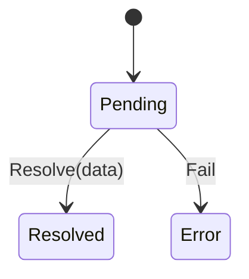
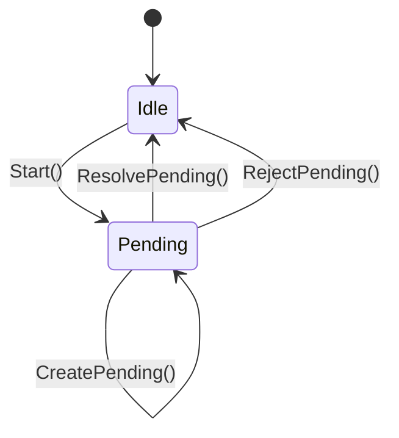

# Synchronizing asynchronous actions

The Dezyne language models every action that does not synchronously return as an asynchronous action, meaning at some later point there will be an event notifying that the event has finished (or failed).

The pattern presented here:
* Allows you to synchronize long-running Dezyne actions without blocking the Dezyne pump
* Allows you to give your clients promise(/future) objects that they can decide how to synchronize on
* Uses the Dezyne verification to prevent you accidentally creating a deadlock or exception

## Promises (and futures)

On our interfaces however, it is usually very convenient to be able to get a notification when the action you requested has finished. This can be done using events or callbacks, but a more modern way of doing this is with promises. In this pattern, the long-running action specifies in its signature that it will take a while, and that it _promises_ to notify the requester when the action is done. In C++ the requester recieves a `std::future` object that will get notified when the promise is resolved:

```c++
// Request doing some long action, which returns a future that will be resolved when done
std::future<Result> f =  SomeLongAction();

// We can now decide how to wait for the future:
// - We could start a new thread and await the future there
// - We could check the future periodically
// In this case, we will block the current thread and await the future here:
Result r = f.get();

// Once the thread is unblocked and we arrived here, we know r is filled with the result
// of our long-running action
```

The state-machine of a promise (and future) object is:



Note: You could do something similar with coroutines but that is out of scope for now

# Promises and Dezyne

So to provide a nice interface to your Dezyne generated code, it is very tidy to make your long-running actions return a promise that will be resolved once the action completes. The question then becomes: how do you decide when to create/resolve/reject your promises. You could to this all in your glue code, but it is quite easy to mismanage your promises and cause a deadlock or error. To this end, we want to pull the promises into Dezyne, so the verification is able to help us to correctly manage it.

The state machine of the Dezyne promise is slightly different, since each promise represents an action, and only futures are shared with clients:



By forcing the Dezyne code to `Start()`, which is only allowed while idle, the verification will force the code to always resolve or reject the promise. If a promise is possibly never resolved, that will lead to a `Start` while not in Idle, i.e. a verification error while writing the code. This forces the Dezyne model to always nicely close the promises it started.

The fact you can only create a pending future for a client while the promise is pending, forces you to correctly start (and thus stop) your promises. Thus giving quite some verification power to this pattern.

## Promise components

To implement this stateful behavior in Dezyne, you will need a component with its own state. Since each component can only track the state of one promise, you will need a separate promise component for each action that needs to be synchronized. The interface and foreign component definition can be found in [promise.dzn](promise.dzn).

## Calling synchronizing functions from C++

When everything is set up in this way, you can call the synchronizing function in C++ like this:

```cpp
void CallSynchronizingFunction() {
    // Call Dezyne function with local shared_future to write
    std::shared_future<dezyne::utils::PromiseFC::PromiseResult> future;
    dzn_system->SynchronizingFunction(future);

    // Synchronize on the future by calling .get(), blocking until the future is resolved
    auto result = future.get();

    // Handle the result of the async operation
    HandleResult(result);
}
```

# Example: Synchronize an asynchronous action

To synchronize an asynchronous action, pass a future in as parameter, and make Dezyne set it pending when starting the action. Once the action completes, resolve the pending future:

```c++
on api.ActionToSynchronize(future): {
    // Start the synchronization action
    actionPromise.Start();
    actionPromise.CreatePending(future);

    // Start async action
    action.Start();
}

on action.Done(): {
    // Resolve pending action for any waiting clients
    actionPromise.ResolvePending();
}

on action.Fail(error): {
    // Reject the future for any waiting clients, with the given error info
    actionPromise.Fail(error);
}
```

# Example: Implement a 'WaitFor' function

An alternative pattern is to have asynchronous actions and events on the outside (i.e. Start/Done on the api in the example), but a synchronous WaitFor method can be used to synchronize if needed:

```c++
on api.AsyncAction(): {
    // Start the synchronization action so we can create pending futures from it if needed
    actionPromise.Start();

    // Start async action
    action.Start();
}

on action.Done(): {
    // Notify api the action is done
    api.Done();

    // Resolve the future for any waiting clients
    actionPromise.ResolvePending();
}

on action.Fail(error): {
    // Notify the api an error occurred
    api.Fail(error);

    // Reject the future for any waiting clients, with the given error info
    actionPromise.Fail(error);
}

on api.WaitForAction(future): { // In this case, the WaitFor function gets the future
    if (action.state.Active) {
        // When the action is active, simply return a pending future
        actionPromise.CreatePending(future);
    } else {
        // Otherwise, if the action is not doing anything simply return an already-resolved future
        actionPromise.CreateResolved(future);
    }
}
```
