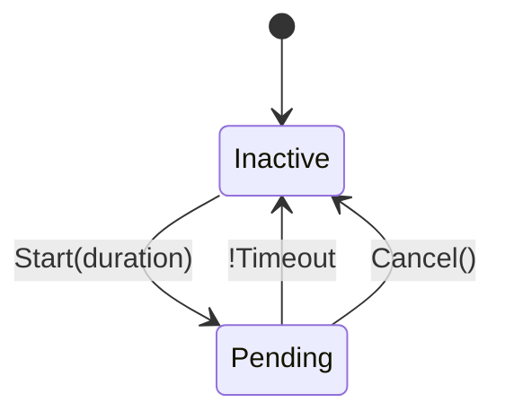

Timers are a common and versatile pattern used when writing Dezyne, used to:

* Delay actions
* Enforce timeouts waiting for input
* Turning `optional` events into an `inevitable` response (useful for writing Armor)

Timers require an update tick from the outside environment to force it to update, and this makes them environment specific, which is why they are not part of the standard language.

This directory contains an example of a timer interface and example usage.

# Dezyne Timers

Timers have a simple state diagram:

They are implemented as foreign components containing C++ implementation of the timer. This means components requiring a timer will `require ITimer timer`, and will need to be connected to an instance of the foreign component in the system. Each timer maintains its own state, if multiple timers are required at the same time, multiple foreign components should be used (connected to multiple `ITimer` ports).

A definition of an `ITimer` interface and `Timer` foreign component can be found in `timer.dzn`.

## Timer foreign component with Dezyne pump

There are multiple ways to implement the timer foreign component, but the simplest is to use the Dezyne pump. Since most dzn code uses a pump anyway, and pumps provide all the required functionality to implement a timer, the foreign component can just use that. An example of this foreign component implementation can be found in `utils_Timer.cpp`

## Timers in case of fixed update ticks

There are cases where the Dezyne pump or even generic threading are not applicalbe, for example when running code in a real-time context with a fixed update step.

In this case timers can still be used, but their event must be fired from within the update tick. The outline for this is roughly as follows:

1. When a timer starts, the timer and its deadline (now + duration) are added to a list of pending timers
2. During every update tick, all pending times are checked if their deadline has expired or not
3. During that same update tick, if a timer deadline has expired, it sends its timeout event into the Dezyne code
